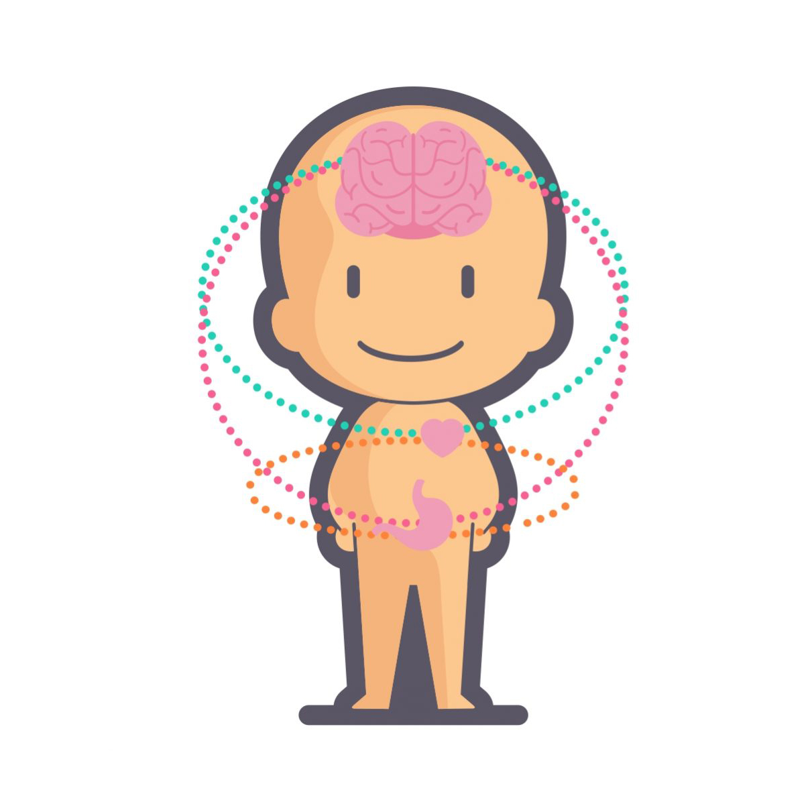

--- 
title: "BABLab Manual"
author: "Bridget Callaghan, Emily Towner"
date: "`r Sys.Date()`"
site: bookdown::bookdown_site
output: bookdown::gitbook
documentclass: book
bibliography: [book.bib, packages.bib]
biblio-style: apalike
link-citations: yes
github-repo: rstudio/bookdown-demo
description: "This is a minimal example of using the bookdown package to write a book. The output format for this example is bookdown::gitbook."
---

# Callaghan Brain and Body Lab Manual

{width=50% height=50%}

Welcome to the Brain and Body Lab at UCLA! 

We are so glad that you are joining us, in whatever capacity it is (undergraduate, research assistant, graduate student, postdoc, visiting scholar, or collaborator). Academia can be a confusing place, and no two labs are the same. We have written this manual to make your transition into the BABLab as smooth as possible, to share the goals of the lab, its inner workings, as well as its unique culture, to which you will contribute. We hope that during your time here, you will learn a lot about the brain and its interactions with the rest of the body, about developmental psychology, and about science in general. It is our collective goal to have everyone leave the lab with more than they started with, should that be new skills, a fresh perspective or understanding on a given topic, and a network of colleagues and friends. We hope that you make it your goal to place your own positive stamp on the lab, and to contribute to it in a meaningful way. Just like us, a lab grows and develops over time, and each individual shapes its path. We look forward to seeing what your time in the lab will bring.
 
This lab manual was inspired by several others, and borrows heavily from them (e.g., [this one](https://github.com/alylab/labmanual/blob/master/aly-lab-manual.pdf) by the Aly Lab and [this one](https://github.com/memobc/memolab-manual) from the Ritchey Lab were the primary sources and the main template I used. A little of this one too).
 
A lot of time was put into the creation of this document. Thinking about what we want our lab to be, what are we going to be known for, and how can we make this lab work for everyone. We really respect the principles and ideas we are aspiring to here, and for that reason, we ask that all new lab members read the manual in full.
 
This lab manual is licensed under a Creative Commons Attribution - NonCommercial 4.0 International License. If you want to make your own manual for a lab, or any other purpose, please feel free to take any ideas and inspiration for this one (and cite us), as well as from the others we have used when making this (and cite them). 

```{r include=FALSE}
# automatically create a bib database for R packages
knitr::write_bib(c(
  .packages(), 'bookdown', 'knitr', 'rmarkdown'
), 'packages.bib')
```
